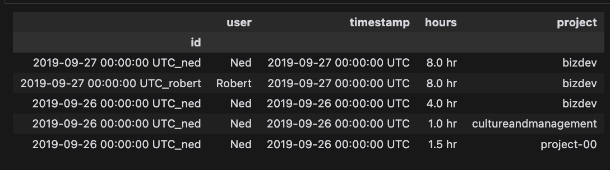
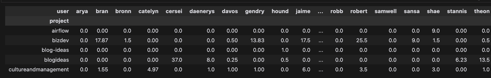
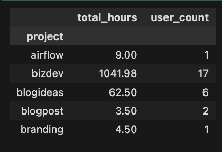
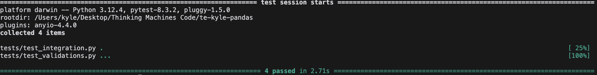
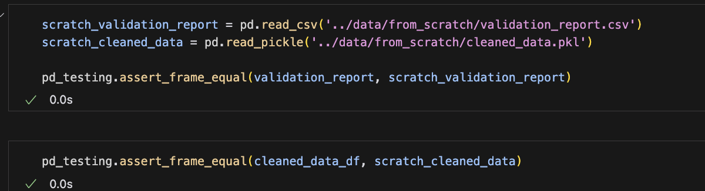

# te-kyle-pandas

A Python project for data validation and cleaning using pandas, designed to support data preprocessing for various analytics and machine learning tasks.

## Overview

This project implements an automated data validation and cleaning pipeline to ensure data quality and consistency. It's part of an ongoing initiative to streamline data preprocessing for analytics and machine learning projects.

## Table of Contents

1. [Project Structure](#project-structure)
2. [Installation and Usage](#installation-and-usage)
3. [Contributing](#contributing)
4. [Technical Details](#technical-details)

## Project Structure

| Name                          | Description                                                            |
| ----------------------------- | ---------------------------------------------------------------------- |
| `README.md`                   | A description and guide for this code repository                       |
| `CONTRIBUTING.md`             | Guidelines for contributing to the project                             |
| `IMPLEMENTATION_QUESTIONS.md` | Answers to the implementation and improvement questions                |
| `src/`                        | A Python directory that contains the main project code                 |
| `src/scratch_poc.ipynb`       | A notebook for scratch work and proof of concept                       |
| `src/test_poc.ipynb`          | A notebook for testing the poc notebook outputs, imports util funcs    |
| `src/tasks.py`                | Contains data cleaning functions                                       |
| `src/validations.py`          | Contains data validation functions                                     |
| `tests/`                      | A Python directory that contains tests for the project                 |
| `tests/test_integration.py`   | Contains integration tests for the entire pipeline                     |
| `tests/test_validations.py`   | Contains unit tests for individual validation functions                |
| `data/`                       | Directory for storing input, output, and intermediate data             |
| `requirements.txt`            | List of Python dependencies for the project                            |

## Installation and Usage

1. Clone the repository:

```bash
git clone https://github.com/yourusername/te-kyle-pandas.git
```

2. Navigate to the project directory:

```bash
cd te-kyle-pandas
```

3. Install the dependencies:

```bash
pip install -r requirements.txt
```

4. Navigate to the notebooks directory, and run the notebooks:
`scratch_poc.ipynb` and `test_validations.ipynb`

5. Run the unit and integration tests:

```bash
pytest tests
```

## Contributing

We welcome contributions! Please see [CONTRIBUTING.md](CONTRIBUTING.md) for details on how to contribute to this project.


## Technical Details

### Data Validation

The data validation process in this project is designed to ensure data quality and consistency. It consists of several key components:

1. **Column Presence Validation**: 
   Checks if all required columns ('user', 'hours', 'project', 'timestamp') are present in the DataFrame.

2. **Hours Validation**: 
   Ensures that the 'hours' column contains valid numeric values between 0 and 24.

3. **Timestamp Format Validation**: 
   Verifies that the 'timestamp' column contains valid date-time values. It supports multiple formats, including UTC timestamps and Russian date formats.

4. **Null Values Check**: 
   Identifies any rows with missing or null values across all columns.

The validation process is implemented in the `validations.py` file.

### Data Cleaning

The data cleaning process in this project is designed to transform and standardize the input data, ensuring it's ready for further analysis. The cleaning process is implemented in the `tasks.py` file and consists of several key steps:

1. **Null Value Removal**: 
   Removes any rows containing null values from the dataset.

2. **Date Transformation**: 
   Converts dates from Russian to English format, standardizing the date representation.

3. **Duplicate Removal**: 
   Eliminates duplicate rows from the dataset to ensure data uniqueness.

4. **Whitespace Stripping**: 
   Removes leading and trailing whitespace from all string fields.

5. **Timestamp Standardization**: 
   Converts all timestamps to a standard UTC format.

6. **Data Type Enforcement**: 
   Ensures that all fields adhere to their expected data types.

The cleaning process is implemented in the `tasks.py` file:

### Data Wrangling

The data wrangling process, implemented in `scratch_poc.ipynb`, involves three main output dataframes, each providing a unique perspective on the cleaned data:

1. **DataFrame 1 (df1)**: User Activity Details
   - Purpose: Provides a detailed view of individual user activities
   - Process:
     - Creates a unique ID by combining timestamp and user
     - Sets this ID as the index for easy reference
     - Formats 'hours' column by appending 'hr' to each value
     - Capitalizes user names for consistency

Shown below is the screenshot of the output of df1:



2. **DataFrame 2 (df2)**: Weekly Project Hours by User
   - Purpose: Offers a snapshot of project hours for a specific week
   - Process:
     - Converts 'timestamp' to datetime format
     - Filters data for a specific week (week of 2018-11-21)
     - Calculates total hours per user per project for that week
     - Creates a pivot table with projects as rows and users as columns
     - Fills missing values with 0 for completeness

Shown below is the screenshot of the output of df2:



3. **DataFrame 3 (df3)**: Annual Project Summary
   - Purpose: Summarizes project data for an entire year
   - Process:
     - Converts 'timestamp' to datetime format
     - Filters data for the year 2017
     - Aggregates data by project
     - Calculates total hours and unique user count for each project

Shown below is the screenshot of the output of df3:



The wrangling process demonstrates the use of various pandas operations including data filtering, grouping, aggregation, and pivot tables, showcasing the versatility of the library in handling complex data transformations.

### Implementation Questions

The answers to the implementation questions are in the [IMPLEMENTATION_QUESTIONS.md](IMPLEMENTATION_QUESTIONS.md) file.

## Testing 

To run the tests, navigate to the project directory and run the following command:

```bash
pytest tests
```

This will execute the tests and provide feedback on the results.

Shown below is the screenshot of the output of the tests:



In addition, the `test_poc.ipynb` notebook was created to test the outputs of the `scratch_poc.ipynb` notebook. This notebook is located in the `src` directory. Shown below is the screenshot of the output of the `test_poc.ipynb` notebook:


